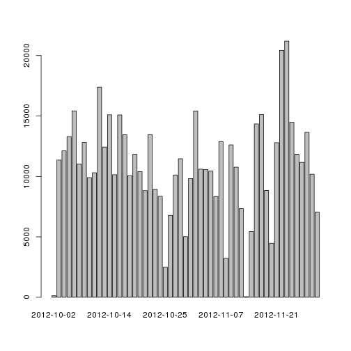

## Loading and preprocessing the data
First the data is loaded into a rawdata variable.

```r
rawdata = read.csv("activity.csv");
```

as it can be seen below, the data format is already adequate so no futher cleaning seemed needed.

```r
head(rawdata)
```

```
##   steps       date interval
## 1    NA 2012-10-01        0
## 2    NA 2012-10-01        5
## 3    NA 2012-10-01       10
## 4    NA 2012-10-01       15
## 5    NA 2012-10-01       20
## 6    NA 2012-10-01       25
```

## What is mean total number of steps taken per day?
For this step, we calculate the total step counts for each day.

```r
steps = c();
dates = unique(rawdata$date);
for(i in 1:length(dates)){
 steps[i] = sum(rawdata$steps[rawdata$date==dates[i]]);
}
barplot(steps[!is.na(steps)],names.arg = strftime(dates[!is.na(steps)]))
```

 

```r
mean_steps = mean(steps,na.rm=TRUE);
median_steps = median(steps,na.rm=TRUE);
```

```r
mean_steps
```

```
## [1] 10766.19
```

```r
median_steps
```

```
## [1] 10765
```

The median and mean were very close together differing by only 1.1886792 .

## What is the average daily activity pattern?
This time the graph was made regarding the time intervals only.
Because of the heavy amount of noise, the mean for each time interval was used on the plot.

```r
stmeans = c();
intervals = unique(rawdata$interval);
for(i in 1:length(intervals)){
 stmeans[i] = sum(rawdata$steps[rawdata$interval==intervals[i]], na.rm=TRUE)/length(sum(rawdata$interval==intervals[i]));
}
plot(intervals,stmeans, type="l" );
```

 

```r
max_steps_on_interval = intervals[which(stmeans == max(stmeans))];
```
The peak activity was around 835

## Imputing missing values
New we devised an strategy for completing the mising values on the dataset. 
We are using the mean data of the steps on an interval during all the days to estimate the new value.

```r
total_missing_val = sum(is.na(rawdata$steps));
new_dataset = rawdata;
for(i in 1:length(new_dataset$steps)){
  if(is.na(new_dataset$steps[i])==TRUE){
    new_dataset$steps[i] = stmeans[intervals==(new_dataset$interval[i])];
  }
}

steps = c();
dates = unique(rawdata$date);
for(i in 1:length(dates)){
 steps[i] = sum(rawdata$steps[rawdata$date==dates[i]]);
}
barplot(steps[!is.na(steps)],names.arg = strftime(dates[!is.na(steps)]))
```

 

```r
mean_steps = mean(steps,na.rm=TRUE);
median_steps = median(steps,na.rm=TRUE);
```

```r
mean_steps
```

```
## [1] 10766.19
```

```r
median_steps
```

```
## [1] 10765
```

As it can be seen the mean and median did not change with our approach since by using the mean values of the intervals we are keeping the spread of the data.


## Are there differences in activity patterns between weekdays and weekends?
To separate the activity into weekdays and weekends a new column was added to the data.


```r
weekday_vector = c();
for(i in 1:length(new_dataset$date)){
  weekd = weekdays(as.Date(new_dataset$date[i]),abbreviate=TRUE);
  if((weekd=="Sat")||(weekd=="Sun")){
    weekday_vector[i] = "weekend";
  }else{
    weekday_vector[i] = "weekday";
  }
}
new_dataset = cbind(new_dataset, weekdayend=weekday_vector);
```

Next we do the same as previous steps and calculate the average amount of steps for each time interval for tue weekdays and weekends to spot any difference.


```r
stmeans = c();
intervals = unique(new_dataset$interval);
for(i in 1:length(intervals)){
 stmeans[i] = sum(new_dataset$steps[(new_dataset$interval[new_dataset$weekdayend=="weekday"]==intervals[i])])/length(sum(new_dataset$interval==intervals[i]));
}
plot(intervals,stmeans, type="l" );
```

 

```r
max_steps_on_interval = max(stmeans);
```


```r
stmeans = c();
intervals = unique(new_dataset$interval);
for(i in 1:length(intervals)){
 stmeans[i] = sum(new_dataset$steps[(new_dataset$interval[new_dataset$weekdayend=="weekend"]==intervals[i])])/length(sum(new_dataset$interval==intervals[i]));
}
plot(intervals,stmeans, type="l" );
```

 

```r
max_steps_on_interval = max(stmeans);
```

As it can be seen by the graphics, the pattern of steps was kept the same on weekdays and on weekends with no noticible difference. 
